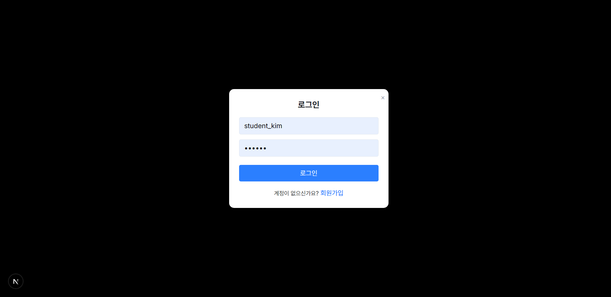
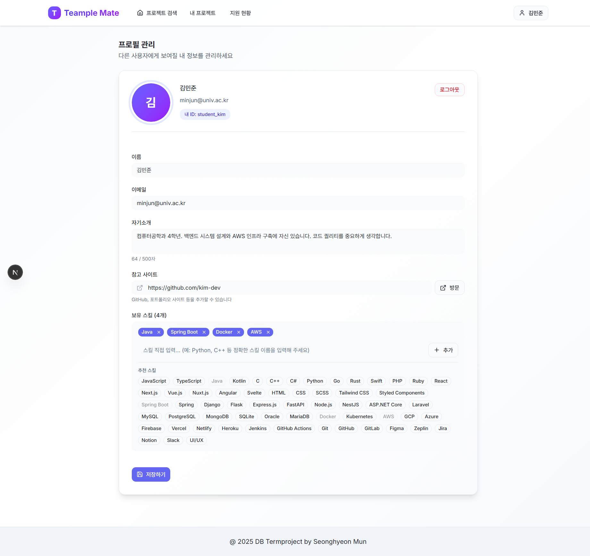
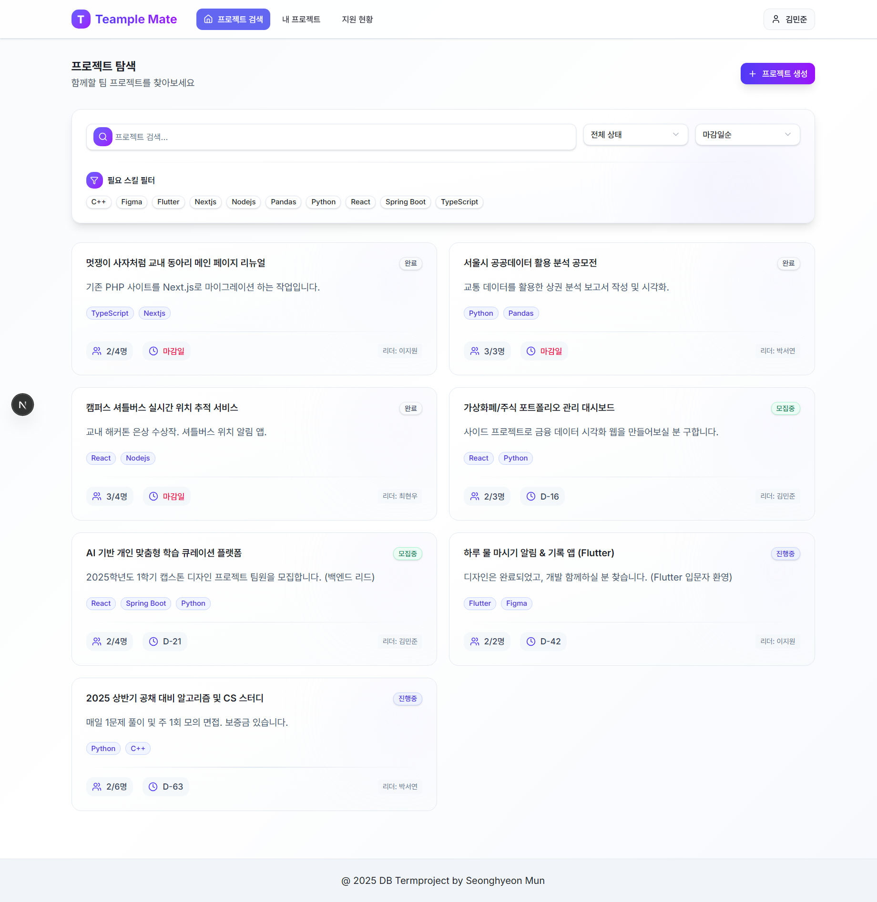
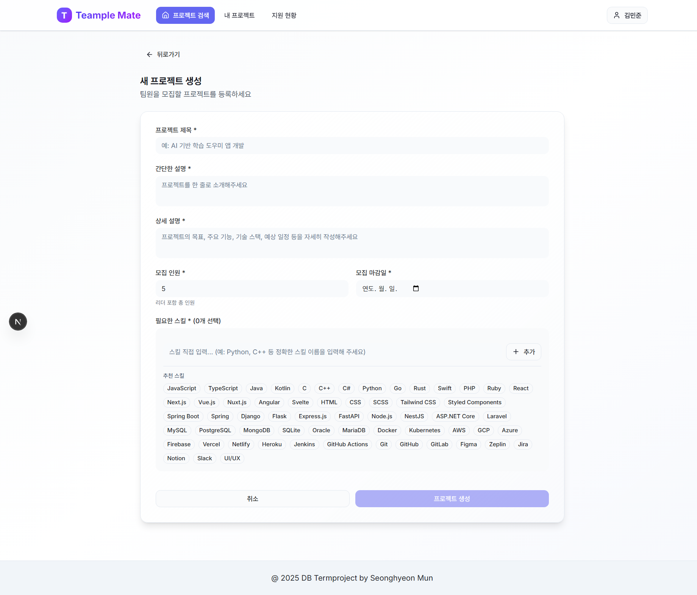
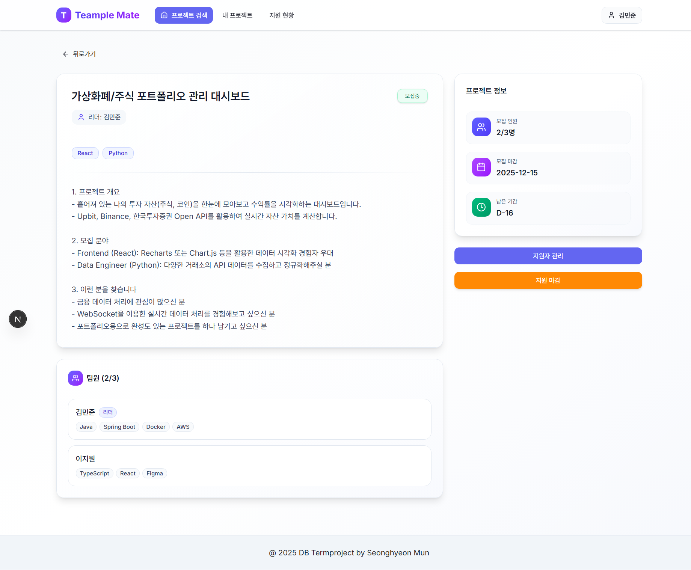
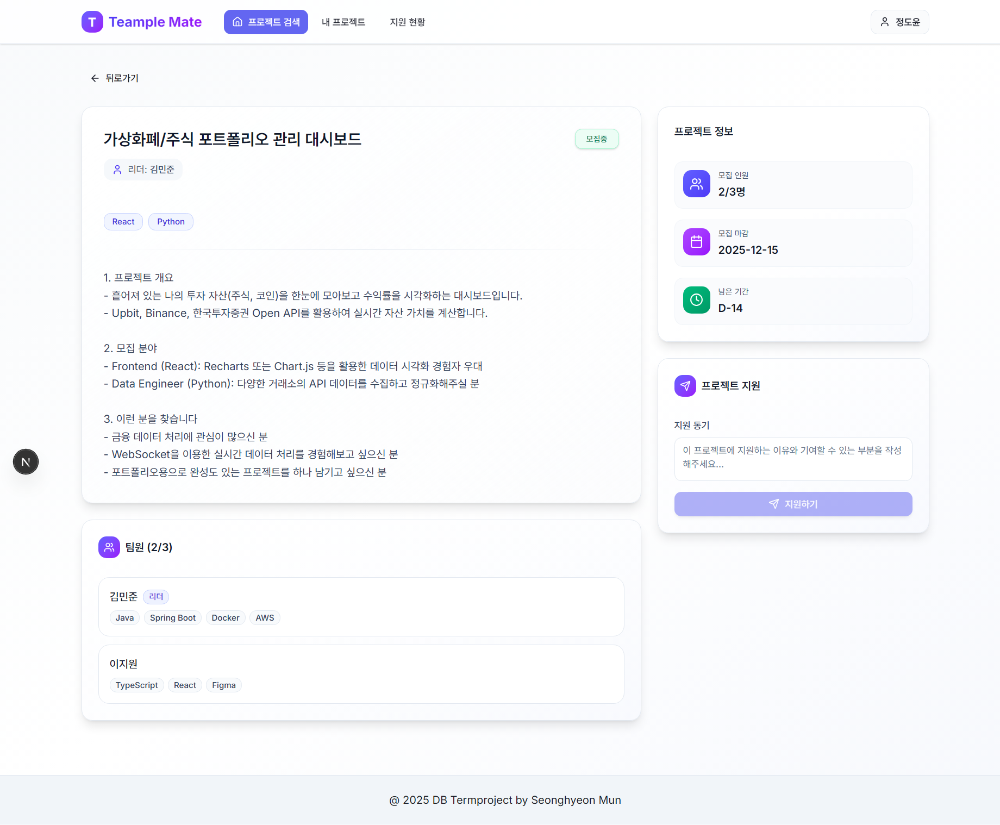
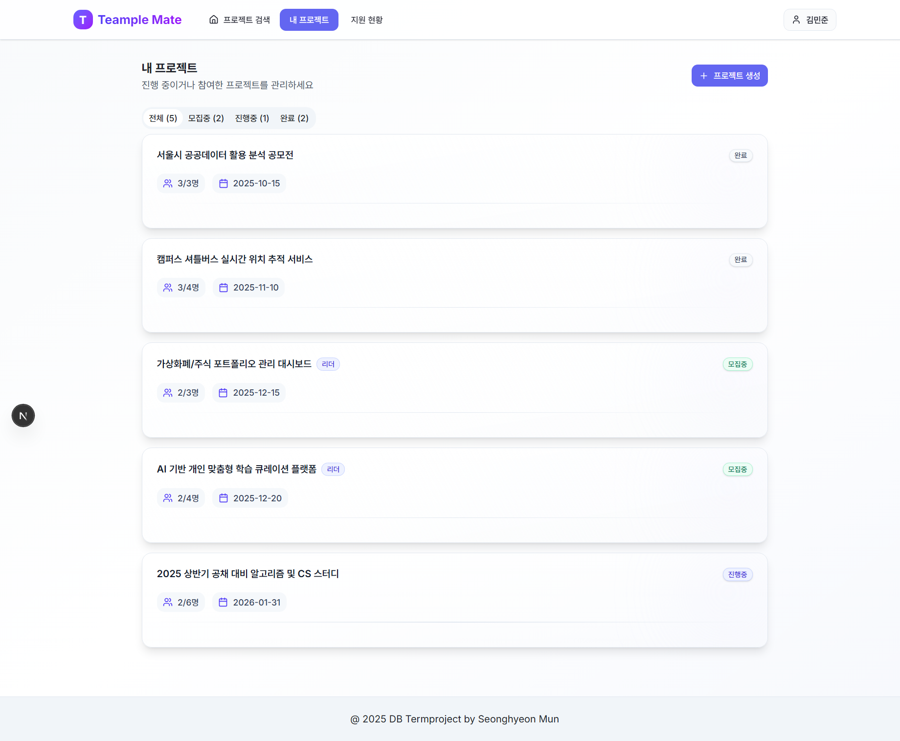
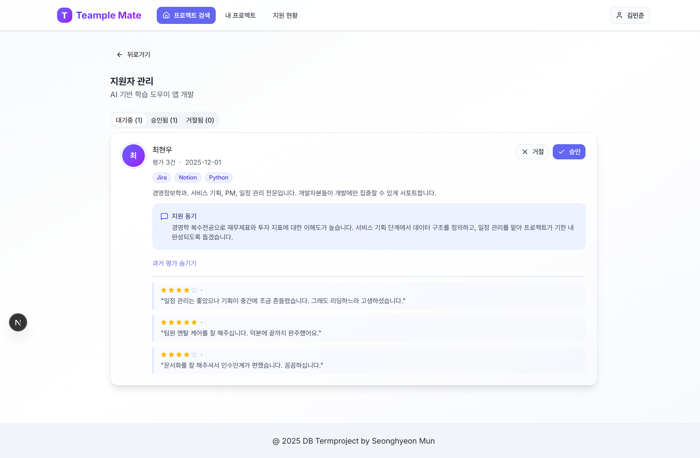
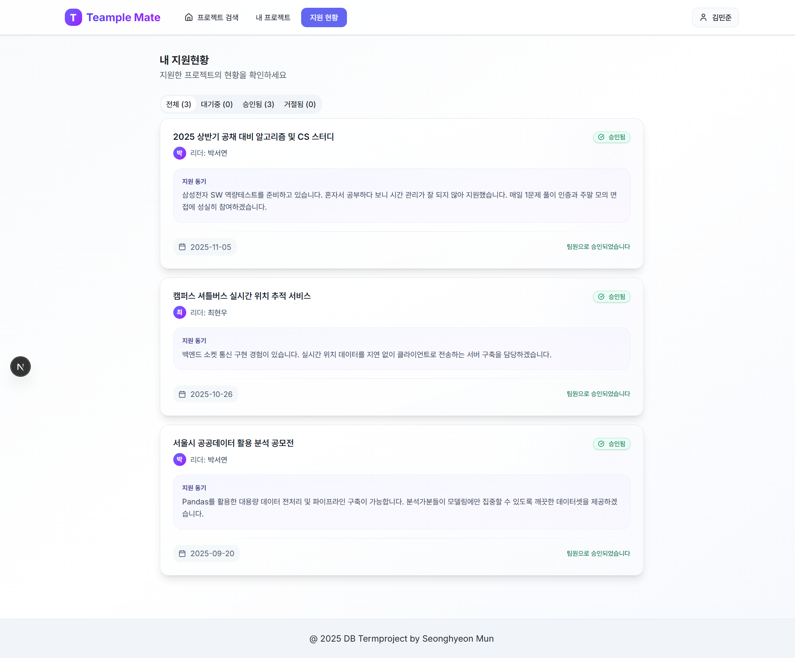

# Teample Mate
 

## 프로젝트 목적
대학생들이 팀 프로젝트를 진행하며 겪는 팀원 매칭의 어려움과 협업 과정에서의 갈등을 해결하기 위해 기획되었습니다.

단순한 팀원 모집을 넘어, 신뢰할 수 있는 동료를 찾고 성공적인 프로젝트 경험을 쌓을 수 있도록 돕는 것을 목표로 합니다.

## 프로젝트 개요
**Teample Mate**는 대학생을 위한 팀 프로젝트 매칭 및 관리 플랫폼입니다.

사용자는 자신의 기술 스택과 프로필을 등록하여 프로젝트를 개설하거나 원하는 팀에 지원할 수 있습니다.
특히, 프로젝트 완료 후 진행되는 **상호 평가(Peer Review)** 시스템을 통해 팀원들의 협업 태도와 기여도를 데이터화합니다.

이를 통해 리더는 지원자의 과거 평가를 참고하여 보다 신뢰할 수 있는 팀원을 선별할 수 있으며, 건강한 팀 프로젝트 문화를 조성하는 데 기여합니다.

## 주요 기능

### 1. 회원가입 및 로그인
아이디와 비밀번호를 이용한 간편한 회원가입 및 로그인 기능을 제공합니다.


### 2. 프로필 관리
자신의 기술 스택, 자기소개 등 프로필 정보를 등록하고 수정할 수 있습니다.


### 3. 프로젝트 목록 조회
모집 중인 프로젝트를 카드 형태로 직관적으로 확인할 수 있습니다.<br> 키워드 검색, 기술 스택 별 필터링, 상태별(모집중/진행중/완료) 필터링 및 마감일/모집인원 순 정렬 기능을 제공합니다. <br> 각 프로젝트 카드를 클릭하여 상세 페이지로 이동할 수 있습니다. 


### 4. 프로젝트 생성
새로운 프로젝트를 개설하며 필요한 기술 스택, 모집 인원, 마감일 등 상세 조건을 설정할 수 있습니다.


### 5. 프로젝트 상세 정보
프로젝트의 제목, 설명, 요구 기술 스택, 현재 팀원 등 상세 정보를 한눈에 확인할 수 있습니다.

- 프로젝트 리더: 프로젝트 상태(지원마감/진행중/완료)를 변경하고, 지원자 관리 페이지로 이동할 수 있습니다.
   

- 일반 사용자: 지원 동기를 작성해 프로젝트에 지원할 수 있습니다.
   

### 6. 내 프로젝트 관리
생성했거나 참여 중인 프로젝트를 한곳에서 관리할 수 있습니다.<br> 각 프로젝트 카드를 클릭하여 상세 페이지로 이동할 수 있습니다.


### 7. 지원자 관리 (리더 전용)
프로젝트 리더는 지원자의 프로필, 기술 스택, 과거 동료 평가 등을 검토하여 팀원 합류를 승인하거나 거절할 수 있습니다.


### 8. 내 지원 현황
지원한 프로젝트의 목록과 상태(대기중/승인됨/거절됨)를 실시간으로 확인할 수 있습니다.



## 기술 스택

<div align="center">

[](https://fastapi.tiangolo.com/)
[](https://www.python.org/)
[](https://pydantic-docs.helpmanual.io/)
[](https://swagger.io/)<br>
 

[](https://www.uvicorn.org/)<br>
[](https://www.sqlalchemy.org/)
[](https://www.postgresql.org/)

[](https://nextjs.org/)
[](https://www.typescriptlang.org/)
[](https://tailwindcss.com/)<br>

[](https://www.radix-ui.com/)
[](https://lucide.dev/)

</div>


## 프로젝트 구조

```
Project/
├── backend/                         # FastAPI 백엔드 서버
│   ├── api/
│   │   ├── deps.py                  # 의존성 주입 (DB 세션 등)
│   │   └── v1/endpoints/            # API 라우터
│   │       ├── auth.py              # 로그인/회원가입
│   │       ├── projects.py          # 프로젝트 생성/조회/수정/삭제/리뷰
│   │       ├── applications.py      # 프로젝트 지원/관리
│   │       └── profile.py           # 사용자 프로필 관리
│   ├── crud/                        # 데이터베이스 쿼리 로직 (ORM/Raw SQL)
│   │   ├── crud_auth.py
│   │   ├── crud_projects.py
│   │   ├── crud_applications.py
│   │   └── crud_profile.py
│   ├── db/                          # 데이터베이스 설정
│   │   ├── session.py               # DB 연결 세션
│   │   ├── utils.py
│   │   └── sql/                     # SQL 스크립트
│   │       ├── CreateTable.sql      # 테이블/뷰 생성 스크립트
│   │       └── App_roles_and_privileges.sql # 권한/역할 설정 스크립트
│   ├── schemas/                     # Pydantic 데이터 스키마 (Request/Response)
│   │   └── schemas.py
│   ├── main.py                      # 앱 진입점 (CORS 설정, 라우터 등록)
│   └── requirements.txt             # Python 패키지 목록
│
├── frontend/                        # Next.js 프론트엔드 클라이언트
│   ├── app/                         # App Router (페이지 라우팅)
│   │   ├── layout.tsx
│   │   ├── page.tsx                 # 메인 페이지
│   │   ├── myapplications/          # 내 지원 현황 페이지
│   │   │   └── page.tsx
│   │   ├── myprojects/              # 내 프로젝트 관리 페이지
│   │   │   └── page.tsx
│   │   ├── profile/                 # 프로필 관리 페이지
│   │   │   └── page.tsx
│   │   └── projects/                # 프로젝트 관련 페이지
│   │       ├── page.tsx             # 프로젝트 목록
│   │       ├── create/              # 프로젝트 생성
│   │       │   └── page.tsx
│   │       └── [id]/                # 프로젝트 상세
│   │           └── page.tsx
│   ├── components/                  # UI 컴포넌트
│   │   ├── auth/                    # 인증 관련
│   │   │   ├── AuthModal.tsx        # 로그인/회원가입 모달
│   │   │   └── AuthProvider.tsx     
│   │   ├── layout/                  # 레이아웃 관련
│   │   │   ├── Navigation.tsx       
│   │   │   └── Footer.tsx           
│   │   ├── projects/                # 프로젝트 관련
│   │   │   ├── ProjectList.tsx   
│   │   │   ├── ProjectCard.tsx    
│   │   │   ├── ProjectDetail.tsx    
│   │   │   ├── CreateProject.tsx    
│   │   │   ├── MyProjects.tsx     
│   │   │   ├── ApplicantManagement.tsx 
│   │   │   └── PeerReview.tsx 
│   │   ├── applications/            # 지원 관련
│   │   │   └── MyApplications.tsx   
│   │   ├── profile/                 # 프로필 관련
│   │   │   └── ProfileManagement.tsx
│   │   └── ui/                      # UI Primitives (shadcn/ui)
│   ├── constants/                   # 상수 (스킬 목록 등)
│   ├── styles/                      
│   └── package.json                 # Node.js 패키지 목록
│
└── README.md                        # 프로젝트 설명서
```

## 개발 환경 설정

### 사전 요구 사항
- **Python** : 3.10 이상
- **Node.js** : 18.0 이상
- **PostgreSQL** : 14.0 이상

### Backend 설정
1. **디렉토리 이동**
   ```bash
   cd backend
   ```

2. **가상환경 생성 및 활성화 (선택 사항)**
   ```bash
   python -m venv venv
   # Windows
   venv\Scripts\activate
   # Mac/Linux
   source venv/bin/activate
   ```

3. **의존성 설치**
   ```bash
   pip install -r requirements.txt
   ```

4. **데이터베이스 설정**
   - PostgreSQL 데이터베이스를 생성합니다. (예: `teample_mate_db`)
   - **생성한 데이터베이스에 접속하여** 다음 스크립트들을 순서대로 실행합니다.
     1. `backend/db/sql/CreateTable.sql`: 테이블 및 뷰 생성
         - 테스트 데이터를 넣고 싶은 경우 `backend/db/sql/CreateTable.sql` 하단에 `backend/db/sql/TestData.sql`을 복사하여 붙여넣고 실행합니다.
     2. `backend/db/sql/CreateRoles.sql`: 역할(Role) 생성
         - (이 파일은 반드시 `postgres`와 같은 **슈퍼유저 계정**으로 실행해야 합니다.)
     3. `backend/db/sql/App_roles_and_privileges.sql` : 권한 부여
   - `backend\.env` 파일을 생성해 다음 정보를 입력합니다.
      ```ini
      POSTGRES_DB=생성한 데이터베이스 이름
      POSTGRES_USER=teample_dev
      POSTGRES_PASSWORD=teample_password
      POSTGRES_HOST=localhost
      POSTGRES_PORT=5432
      ```

5. **서버 실행**
   ```bash
   uvicorn main:app --reload
   ```
   - 서버는 `http://localhost:8000`에서 실행됩니다.
   - API 문서는 `http://localhost:8000/docs`에서 확인할 수 있습니다.

### Frontend 설정
1. **디렉토리 이동**
   ```bash
   cd frontend
   ```

2. **의존성 설치**
   ```bash
   npm install
   ```

3. **개발 서버 실행**
   ```bash
   npm run dev
   ```
   - 웹 애플리케이션은 `http://localhost:3000`에서 실행됩니다.

## 데이터베이스 스키마

주요 테이블 구조는 다음과 같습니다.

| 테이블 | 정보 | 
|---|---|
| **Students** | 사용자(학생) 정보 |
| **Skills** | 보유 가능한 기술 스택 목록 |
| **Student_Skills** | 학생과 스킬의 N:M 관계 | 
| **Projects** | 프로젝트 정보 | 
| **Project_Required_Skills** | 프로젝트 요구 스킬 | 
| **Applications** | 프로젝트 지원 현황 | 
| **Peer_Reviews** | 팀원 상호 평가 | 

자세한 스키마는 ```backend\db\sql\CreateTable.sql``` 참조

