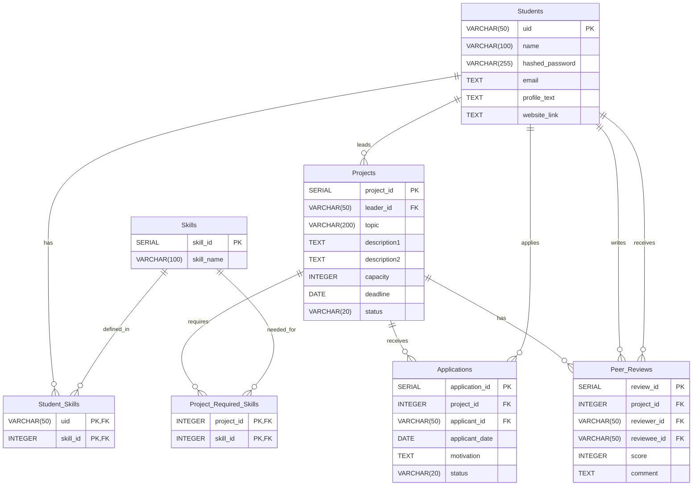

# Database Schema & Diagram

## Diagram


## Table 설명

### **Students**
사용자(학생) 정보를 저장하는 테이블입니다.
```sql
CREATE TABLE Students (
  uid VARCHAR(50) PRIMARY KEY,
  name VARCHAR(100) NOT NULL,
  hashed_password VARCHAR(255) NOT NULL,
  email TEXT DEFAULT '' NOT NULL,
  profile_text TEXT DEFAULT '' NOT NULL,
  website_link TEXT DEFAULT '' NOT NULL
);
```
- `uid`: 사용자 고유 ID (PK)
- `name`: 사용자 이름
- `hashed_password`: 암호화된 비밀번호
- `email`: 이메일 주소
- `profile_text`: 자기소개 텍스트
- `website_link`: 개인 웹사이트 또는 포트폴리오 링크

### **Skills**
시스템에서 사용 가능한 기술 스택 목록을 관리합니다.
```sql
CREATE TABLE Skills (
    skill_id SERIAL PRIMARY KEY,
    skill_name VARCHAR(100) UNIQUE NOT NULL CHECK (skill_name = LOWER(skill_name))
);
```
- `skill_id`: 스킬 고유 ID (PK)
- `skill_name`: 스킬 이름 (소문자로 저장, Unique)

### **Student_Skills**
학생과 기술 스택 간의 다대다(N:M) 관계를 매핑합니다.
```sql
CREATE TABLE Student_Skills (
    uid VARCHAR(50) NOT NULL,
    skill_id INTEGER NOT NULL,
    PRIMARY KEY (uid, skill_id),
    FOREIGN KEY (uid) REFERENCES Students(uid),
    FOREIGN KEY (skill_id) REFERENCES Skills(skill_id)
);
```
- `uid`: 학생 ID (FK)
- `skill_id`: 스킬 ID (FK)

### **Projects**
생성된 프로젝트 정보를 저장합니다.
```sql
CREATE TABLE Projects (
    project_id SERIAL PRIMARY KEY,
    leader_id VARCHAR(50) NOT NULL REFERENCES Students(uid),
    topic VARCHAR(200) NOT NULL,
    description1 TEXT NOT NULL,
    description2 TEXT NOT NULL,
    capacity INTEGER NOT NULL,
    deadline DATE NOT NULL,
    status VARCHAR(20) DEFAULT 'Recruiting' CHECK (status IN ('Recruiting', 'In_Progress', 'Completed'))
);
```
- `project_id`: 프로젝트 고유 ID (PK)
- `leader_id`: 프로젝트 생성자(리더) ID (FK)
- `topic`: 프로젝트 주제/제목
- `description1`: 간단한 설명
- `description2`: 상세 설명
- `capacity`: 모집 정원
- `deadline`: 모집 마감일
- `status`: 프로젝트 상태 ('Recruiting', 'In_Progress', 'Completed')

### **Project_Required_Skills**
프로젝트와 요구 기술 스택 간의 다대다(N:M) 관계를 매핑합니다.
```sql
CREATE TABLE Project_Required_Skills (
    project_id INTEGER NOT NULL,
    skill_id INTEGER NOT NULL,
    PRIMARY KEY (project_id, skill_id),
    FOREIGN KEY (project_id) REFERENCES Projects(project_id),
    FOREIGN KEY (skill_id) REFERENCES Skills(skill_id)
);
```
- `project_id`: 프로젝트 ID (FK)
- `skill_id`: 스킬 ID (FK)

### **Applications**
프로젝트 지원 내역을 관리합니다.
```sql
CREATE TABLE Applications (
    application_id SERIAL PRIMARY KEY,
    project_id INTEGER NOT NULL REFERENCES Projects(project_id),
    applicant_id VARCHAR(50) NOT NULL REFERENCES Students(uid),
    applicant_date DATE NOT NULL,
    motivation TEXT NOT NULL,
    status VARCHAR(20) DEFAULT 'Pending' CHECK (status IN ('Pending', 'Accepted', 'Rejected')),
    UNIQUE (project_id, applicant_id)
);
```
- `application_id`: 지원 내역 고유 ID (PK)
- `project_id`: 지원한 프로젝트 ID (FK)
- `applicant_id`: 지원자 ID (FK)
- `applicant_date`: 지원 날짜
- `motivation`: 지원 동기
- `status`: 지원 상태 ('Pending', 'Accepted', 'Rejected')

### **Peer_Reviews**
프로젝트 완료 후 팀원 간 상호 평가 데이터를 저장합니다.
```sql
CREATE TABLE Peer_Reviews (
    review_id SERIAL PRIMARY KEY,
    project_id INTEGER NOT NULL REFERENCES Projects(project_id),
    reviewer_id VARCHAR(50) NOT NULL REFERENCES Students(uid),
    reviewee_id VARCHAR(50) NOT NULL REFERENCES Students(uid),
    score INTEGER NOT NULL CHECK (score >= 1 AND score <= 5),
    comment TEXT NOT NULL,
    UNIQUE (project_id, reviewer_id, reviewee_id),
    CHECK (reviewer_id != reviewee_id)
);
```
- `review_id`: 리뷰 고유 ID (PK)
- `project_id`: 해당 프로젝트 ID (FK)
- `reviewer_id`: 리뷰 작성자 ID (FK)
- `reviewee_id`: 리뷰 대상자 ID (FK)
- `score`: 평점 (1~5점)
- `comment`: 평가 코멘트

## View 설명

데이터 조회 편의성과 보안을 위해 생성된 뷰입니다.

- **RecruitingProjectsView**: 현재 모집 중(`Recruiting`)이고 마감일이 지나지 않은 프로젝트 목록을 조회합니다.
- **InProgressProjectsView**: 진행 중(`In_Progress`)인 프로젝트 목록을 조회합니다.
- **CompletedProjectsView**: 완료된(`Completed`) 프로젝트 목록을 조회합니다.
- **ProjectApplicantsView**: 리더가 지원자를 관리할 때 필요한 정보(지원자 프로필, 스킬, 과거 리뷰 등)를 종합하여 제공합니다.

## Index 설명

주요 조회 쿼리의 성능 최적화를 위해 생성된 인덱스입니다.

- **idx_projects_leader**: `Projects(leader_id)`
  - 리더가 본인의 프로젝트를 자주 조회한다는 특성을 반영하여, 전체 테이블을 탐색하지 않고 빠르게 데이터를 찾을 수 있도록 최적화합니다.
- **idx_projects_recruiting_deadline**: `Projects(deadline) WHERE status = 'Recruiting'`
  - 사용자가 가장 많이 조회하는 '모집 중' 상태의 프로젝트만 선별적으로 인덱싱하여, 불필요한 데이터 탐색을 줄이고 정렬 속도를 최적화합니다. (Partial Index)
- **idx_applications_project_accepted**: `Applications(project_id) WHERE status = 'Accepted'`
  - 전체 지원 내역 중 '승인된' 건만 인덱싱하여, 빈번하게 발생하는 프로젝트별 팀원 수 집계와 목록 조회 시 처리 비용을 최소화합니다. (Partial Index)
